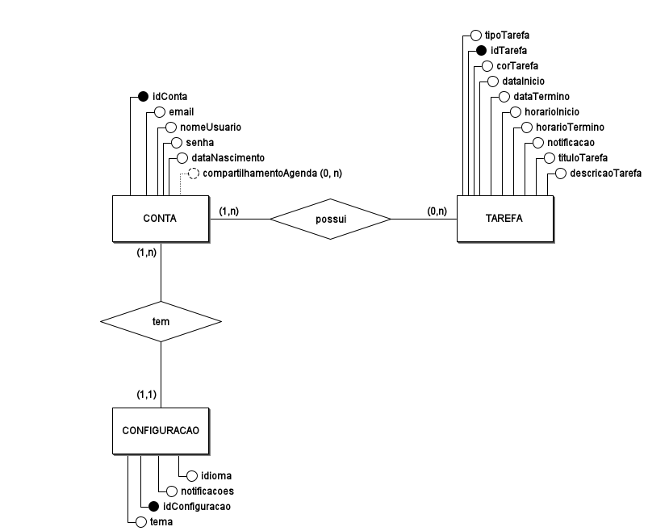

# Diagrama Entidade-Relacionamento (DE-R)

## Introdução

Um diagrama conceitual é uma representação visual de conceitos e suas relações. Ele usa formas, como caixas ou círculos, para representar os conceitos e setas ou linhas para representar os relacionamentos entre eles. Serve para organizar e estruturar informações, facilitando a compreensão de ideias complexas e a comunicação entre pessoas. Pode ser usado em diversas áreas, desde a educação até o desenvolvimento de software, para planejar, analisar e documentar informações de forma clara e concisa. Em resumo, é uma ferramenta poderosa para visualizar e comunicar conhecimento.

## Resultados

### Legenda do Diagrama Entidade-Relacionamento (DE-R)

**Entidades:**

* Representadas por retângulos.
* Nome da entidade dentro do retângulo, geralmente no singular e substantivado.
* Representam conjuntos de objetos ou conceitos com características em comum.

**Atributos:**

* Representados por circulos ligados às entidades.
* Nome do atributo ao lado do circulo.
* Descrevem as características ou propriedades das entidades.

**Atributos Chave:**

* Representados por circulor cheios.
* Identificam unicamente cada instância de uma entidade (chaves primárias).

**Relacionamentos:**

* Representados por losangos ligados às entidades.
* Nome do relacionamento dentro do losango, geralmente um verbo.
* Descrevem como as entidades se relacionam entre si.

**Cardinalidade:**

* Representada por números ou símbolos próximos às linhas de relacionamento.
* Indica a quantidade de instâncias de uma entidade que podem se relacionar com instâncias de outra entidade.
* Os tipos mais comuns de cardinalidade são:
    * **1:1 (Um para Um):** Uma instância de uma entidade se relaciona com apenas uma instância de outra entidade.
    * **1:N (Um para Muitos):** Uma instância de uma entidade pode se relacionar com várias instâncias de outra entidade.
    * **N:1 (Muitos para Um):** Várias instâncias de uma entidade podem se relacionar com apenas uma instância de outra entidade.
    * **N:M (Muitos para Muitos):** Várias instâncias de uma entidade podem se relacionar com várias instâncias de outra entidade.

**Atributos Multivalorados:**

* Representados por ovais duplas.
* Podem assumir mais de um valor para uma mesma instância de uma entidade.

## Breve explicação

Este Diagrama Entidade-Relacionamento (DER) modela um sistema de agenda, representando as entidades principais e seus relacionamentos.

**Entidades:**

* **CONTA:** Representa a conta do usuário no sistema. Possui atributos como `idConta` (chave primária), `email`, `nomeUsuario`, `senha`, `dataNascimento` e `compartilhamentoAgenda`. O atributo `compartilhamentoAgenda` dá a possibilidade de compartilhar a agenda com outros usuários.
* **TAREFA:** Representa uma tarefa individual na agenda. Seus atributos incluem `idTarefa` (chave primária), `tipoTarefa`, `corTarefa`, `dataInicio`, `dataTermino`, `horarioInicio`, `horarioTermino`, `notificacao`, `tituloTarefa` e `descricaoTarefa`.
* **CONFIGURACAO:** Representa as configurações da agenda de um usuário. Possui atributos como `idConfiguracao` (chave primária), `idioma`, `notificacoes` e `tema`.

**Relacionamentos:**

* **possui:** Relaciona `CONTA` e `TAREFA`. Indica que uma conta pode possuir várias tarefas (cardinalidade 0:N do lado da conta) e uma tarefa pode pertencer a mais de uma conta (cardinalidade 0:N do lado de tarefa.
* **tem:** Relaciona `CONTA` e `CONFIGURACAO`. Indica que uma conta possui uma configuração (cardinalidade 1:1 ou N:1, provavelmente 1:1 para garantir que cada conta tenha suas próprias configurações) e uma configuração pertence a uma conta. A cardinalidade (0,n) do lado da configuração é questionável, pois sugere que uma configuração pode pertencer a várias contas, o que não é usual.  Provavelmente deveria ser 1:1 ou N:1.

## Histórico de Versão

| Versão | Data | Descrição | Autor(es) | Data de revisão | Revisor(es) |
| :-: | :-: | :-: | :-: | :-: | :-: |
| `1.0` | 25/11/2024  | Versão inicial do artefato. | [Hugo Queiroz](https://github.com/melohugo) e [João Barreto](https://github.com/JoaoBarreto03) |  |   |
