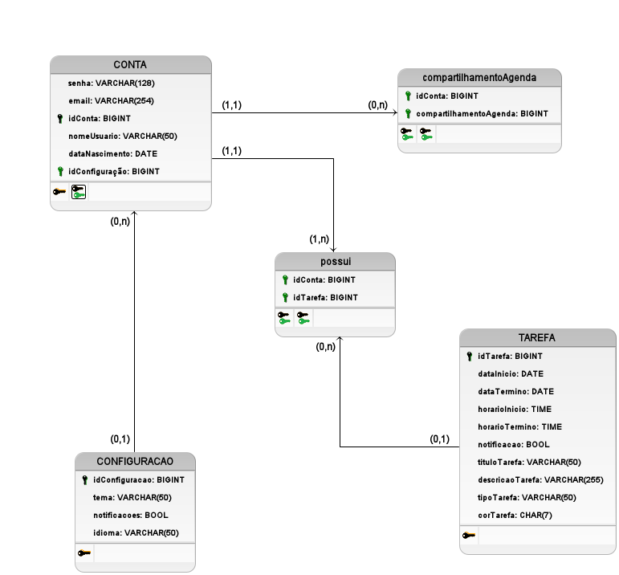

# Diagrama Lógico de Dados (DLD)

## Introdução

O Diagrama de Linguagem de Descrição (DLD), também conhecido como Diagrama de Classes de Implementação, é uma representação visual que demonstra a estrutura e o comportamento de um sistema orientado a objetos em termos de suas classes e seus relacionamentos. Essencialmente, ele refina o diagrama de classes da UML, adicionando detalhes específicos de implementação, como tipos de dados, visibilidade de atributos e métodos (público, privado, protegido), e interfaces. DLDs são particularmente úteis durante a fase de implementação de um projeto de software, fornecendo aos desenvolvedores uma visão clara de como as classes devem ser codificadas. Eles ajudam a garantir a consistência entre o design e a implementação, facilitando a comunicação entre os membros da equipe e a manutenção do código a longo prazo. Em resumo, o DLD serve como uma ponte entre o design abstrato e o código concreto.

## Resultados

### Legenda do Diagrama Lógico de Dados (DLD)

O DLD descreve a estrutura das tabelas e seus relacionamentos, com foco nos detalhes de implementação para o banco de dados.

**Tabelas:**

* Representadas por retângulos divididos em três seções:
  * **Nome da Tabela:** Na parte superior.
  * **Atributos:** Na seção inferior.
    * `nomeAtributo`: Nome do atributo/coluna.
    * `tipoDado`: Tipo de dado do atributo (ex: INT, VARCHAR, DATE).

**Cardinalidade:**

* Indicada nas extremidades das linhas de relacionamento.
  * **1:1** Um pra um.
  * **0:n**: Zero ou muitos.
  * **1:n**: Um ou muitos.

**Chaves:**

* **PK (Chave Primária)**.
* **FK (Chave Estrangeira)**.

## Breve explicação

Tabelas:

- CONTA: Armazena informações sobre os usuários. Cada conta possui um idConta (chave primária), email, senha, nomeUsuario, dataNascimento e um idConfiguracao que a relaciona com suas configurações.

- TAREFA: Representa as tarefas da agenda. Cada tarefa tem um idTarefa (chave primária), datas de início e término (dataInicio, dataTermino), horários de início e término (horarioInicio, horarioTermino), um título (tituloTarefa), uma descrição (descricaoTarefa), um tipo (tipoTarefa), uma cor (corTarefa) e um indicador de notificação (notificacao).

- CONFIGURACAO: Guarda as preferências de cada usuário, como idioma, tema e configurações de notificacoes. Cada configuração tem um idConfiguracao como chave primária.

- compartilhamentoAgenda: Representa o compartilhamento de agendas entre usuários. Contém idConta e compartilhamentoAgenda como chaves, relacionando quem compartilha com quem.

- possui: Tabela associativa que representa o relacionamento entre contas e tarefas. Ela possui as chaves estrangeiras idConta e idTarefa, indicando quais tarefas pertencem a qual conta.

## Histórico de Versão

| Versão | Data | Descrição | Autor(es) | Data de revisão | Revisor(es) |
| :-: | :-: | :-: | :-: | :-: | :-: |
| `1.0` | 25/11/2024  | Versão inicial do artefato. | [Hugo Queiroz](https://github.com/melohugo) e [João Barreto](https://github.com/JoaoBarreto03) |  |   |
