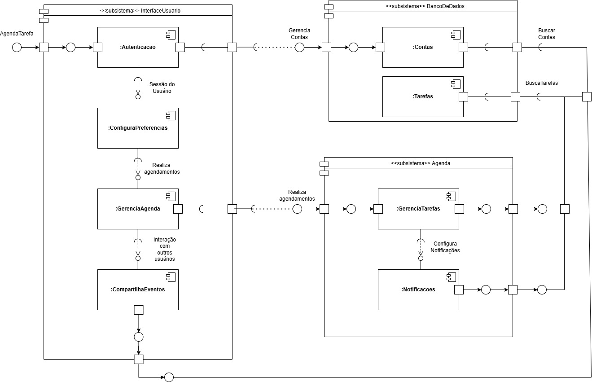

# Diagrama de Componentes

## Introdução

O diagrama de componentes é uma representação gráfica que ilustra a arquitetura física de um sistema de software, destacando a estrutura e as interações entre seus diferentes componentes. Esse tipo de diagrama é essencial para entender como as partes de um sistema se organizam e se relacionam, facilitando a visualização das dependências e das interfaces de comunicação entre os módulos. Em projetos complexos, como aplicações de grande escala, o diagrama de componentes permite que desenvolvedores e arquitetos de software compreendam a divisão de responsabilidades, os pontos de integração e as dependências críticas, além de facilitar o trabalho colaborativo.

Na UML (Unified Modeling Language), o diagrama de componentes é amplamente utilizado para descrever a infraestrutura física dos sistemas e auxiliar na tomada de decisões arquiteturais. Segundo Fowler (2003), o diagrama de componentes é uma ferramenta fundamental para o planejamento de sistemas modulares, pois promove a reutilização e a manutenção do código, além de facilitar a adaptação e a expansão do sistema em resposta a novas necessidades.

O diagrama apresentado aqui representa a arquitetura de um sistema de agendamento, com módulos divididos em subsistemas como "InterfaceUsuario", "BancoDeDados" e "Agenda". Esses subsistemas agrupam componentes responsáveis por funcionalidades específicas, promovendo uma abordagem modular que facilita a organização, o desenvolvimento e a escalabilidade da aplicação.

## Resultados

O diagrama acima modela um sistema de agendamento, denominado "AgendaTarefa", composto por três subsistemas principais:

1. **InterfaceUsuario**: Este subsistema engloba componentes voltados para a interação do usuário com a aplicação. Ele contém os módulos de:
   - **Autenticacao**: Gerencia o acesso dos usuários ao sistema, autenticando e autorizando a entrada.
   - **ConfiguraPreferencias**: Permite que os usuários configurem preferências pessoais, ajustando o sistema conforme suas necessidades.
   - **GerenciaAgenda**: Responsável pela criação e organização de eventos e compromissos na agenda do usuário.
   - **CompartilhaEventos**: Facilita a interação e o compartilhamento de eventos entre diferentes usuários, promovendo colaboração e comunicação dentro da aplicação.

2. **BancoDeDados**: Este subsistema trata do armazenamento e da recuperação de dados persistentes para o sistema. Ele possui dois componentes principais:
   - **Contas**: Gerencia as informações de contas de usuário, permitindo operações de criação, atualização e busca de dados relacionados às contas.
   - **Tarefas**: Responsável por armazenar e gerenciar os dados de tarefas, facilitando o armazenamento de informações relacionadas aos agendamentos e às atividades dos usuários.

3. **Agenda**: Este subsistema é responsável pela gestão de tarefas e notificações no sistema. Ele possui os seguintes componentes:
   - **GerenciaTarefas**: Organiza e controla as tarefas agendadas, garantindo que os compromissos sejam mantidos em ordem e atualizados conforme necessário.
   - **Notificacoes**: Configura e dispara notificações para os usuários, mantendo-os informados sobre eventos e lembretes importantes.

Cada subsistema é projetado para encapsular funcionalidades específicas, promovendo uma arquitetura modular e permitindo uma manutenção mais eficiente. As interações entre esses subsistemas ocorrem de forma controlada por meio de interfaces bem definidas, garantindo que a comunicação entre componentes seja segura e organizada. Essa abordagem modular ajuda a reduzir a complexidade do sistema, facilitando tanto a implementação quanto o entendimento do funcionamento da aplicação.

## Referências

- Fowler, M. (2003). UML Distilled: Um Guia Rápido para a Linguagem de Modelagem de Objetos Padrão. Addison-Wesley Professional.

- Lucid Software Inc. (s.d.). Lucidchart. Acesso em (https://www.lucidchart.com)

## Histórico de Versão

| Versão | Data | Descrição | Autor(es) | Data de revisão | Revisor(es) |
| :-: | :-: | :-: | :-: | :-: | :-: |
| `1.0` | 09/11/2024  | Versão inicial do artefato. | [Vitor Feijó](https://github.com/vitorfleonardo) | 09/11/2024 | [João Barreto](https://github.com/JoaoBarreto03) |
| `1.1` | 09/11/2024  | Explicação e construção do Diagrama de Componentes. | [João Barreto](https://github.com/JoaoBarreto03), [Hugo Melo](https://github.com/melohugo), [Ricardo Augusto](https://github.com/avmricardo), [Danilo Carvalho](https://github.com/Danilo-Carvalho-Antunes) | | |
