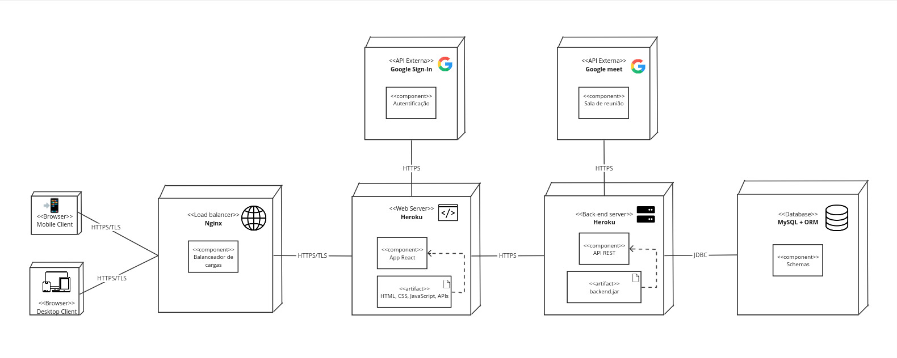

# Diagrama de Implementação

## Introdução

O **diagrama de implantação** é um diagrama de estrutura que mostra a arquitetura do sistema como implantação (distribuição) de artefatos de software para alvos de implantação.

**Elementos do Diagrama de Implementação:**

1. **Componentes**: 
   - São os módulos de software, como classes, pacotes ou subsistemas, que representam as partes do sistema que possuem responsabilidade de execução ou armazenamento de dados. 
   - No diagrama, os componentes são geralmente representados por retângulos com o nome do componente dentro.

2. **Artefatos**: 
   - São representações físicas de componentes, como arquivos executáveis, bibliotecas, scripts de configuração, bancos de dados, entre outros.
   - No diagrama, os artefatos são representados como caixas ou retângulos com o nome do artefato.

3. **Nós (Nodes)**:
   - São os elementos físicos que executam ou armazenam os artefatos, como servidores, dispositivos, ou máquinas virtuais.
   - Um nó pode ser representado por um cubo e contém dentro de si os artefatos que são executados ou armazenados naquele hardware específico.

4. **Dependências**:
   - Representam as relações de interação entre os componentes ou entre artefatos.
   - As dependências são mostradas por setas, indicando como um componente depende ou interage com outro.

5. **Interfaces**:
   - São pontos de comunicação entre os componentes ou artefatos, especificando os serviços ou funcionalidades que um componente oferece ou exige de outro.
   - As interfaces ajudam a definir como as partes do sistema interagem, sem expor a implementação interna.

## Resultados

A modelagem proposta para a solução da Agenda foi a seguinte, exposta na imagem 1:

<b>Imagem 1. Diagrama de implementação. Autor(es):</b>  [Carlos Alves](https://github.com/CADU110), [Vitor Feijó](https://github.com/vitorfleonardo), [Gabriel Moura Dos Santos](https://github.com/thegm445) e [Yago Passos](https://github.com/yagompassos), 2024.

## Breve explicação

O diagrama mostra a arquitetura de um sistema web que usa vários componentes, sendo:

1. **Clientes:** Os usuários interagem com o sistema por meio de navegadores em dispositivos móveis ou desktop.

2. **Balanceador de carga (Nginx):** Distribui o tráfego entre os servidores web disponíveis para garantir disponibilidade e desempenho.

3. **Servidores Web (Heroku):** Hospedam a aplicação web React, que serve HTML, CSS, JavaScript e APIs para os clientes.

4. **Servidor de Back-end (Heroku):** Fornece uma API REST implementada em Java que interage com o banco de dados e outras APIs externas.

5. **Banco de dados (MySQL + ORM):** Armazena os dados do sistema. O ORM (Object-Relational Mapper) facilita a interação entre o servidor de back-end e o banco de dados.

6. **APIs Externas (Google Sign-In e Google Meet):** Fornecem serviços de autenticação e videoconferência, respectivamente.

**Fluxo de comunicação:**

1. As solicitações dos clientes são direcionadas ao balanceador de carga Nginx via HTTPS/TLS.

2. O Nginx distribui as solicitações para os servidores web Heroku.

3. O servidor web executa a aplicação React, que pode fazer solicitações à API REST no servidor de back-end via HTTPS.

4. A API REST interage com o banco de dados MySQL via JDBC e pode também se comunicar com as APIs externas Google Sign-In e Google Meet via HTTPS.

Em resumo, o diagrama apresenta uma arquitetura típica de aplicação web em camadas, com componentes separados para lidar com diferentes aspectos da funcionalidade do sistema e comunicação segura entre eles.

## Referências

> <a>1.</a> Rational Software Architect Standard Edition, IBM Documentation. **Diagramas de Implementação**, 2021. Disponível em: [IBM Documentation](https://www.ibm.com/docs/pt-br/rsas/7.5.0) 
> <a>2.</a> UML Diagrams. **Deployment Diagrams Overview**, 2021. Disponível em: [Uml Diagrams](https://www.uml-diagrams.org/deployment-diagrams-overview.html) 

## Histórico de Versão

| Versão | Data | Descrição | Autor(es) | Data de revisão | Revisor(es) |
| :-: | :-: | :-: | :-: | :-: | :-: |
| `1.0` | 09/11/2024  | Versão inicial do artefato. | [Vitor Feijó](https://github.com/vitorfleonardo) | 13/11/2024  | [Yago Passos](https://github.com/yagompassos)  |
| `1.1` | 13/11/2024  | Introdução e início do desenvolvimento do diagrama. | [Yago Passos](https://github.com/yagompassos)  |   |   |
| `1.2` | 13/11/2024  | Implementando versão 02. | [Carlos Alves](https://github.com/CADU110), [Vitor Feijó](https://github.com/vitorfleonardo) e  [Gabriel Moura Dos Santos](https://github.com/thegm445) | 25/11/2024  |  [Yago Passos](https://github.com/yagompassos)  |
| `1.3` | 25/11/2024  | Padronização. | [Yago Passos](https://github.com/yagompassos)  |   |   |
