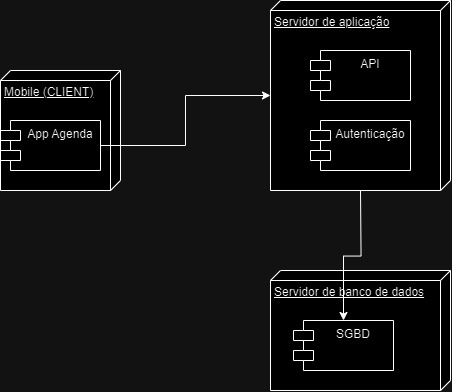

# Diagrama de Implementação

## Introdução

No UML, os diagramas de implementação, também chamados de diagramas de implantação, representam a estrutura arquitetural física de um projeto. Os nós do diagrama representam dispositivos de hardware, como por exemplo servidores, sensores e impressoras. Eles incluem artefatos internos, representando softwares. Caminhos de comunicação e relacionamentos de implementação modelam as conexões do sistema, mostrando os relacionamentos entre os componentes do sistema distribuido, modelando a forma física do processamento <a id="a" href="#aa">[1]</a>.

## Resultados

A modelagem proposta para a solução da Agenda foi a seguinte, exposta na imagem 1:

Diagrama ainda sendo montado: https://drive.google.com/file/d/16IYjAgeuqAYnLW-eqD_yLIrcdQsypXgS/view?usp=sharing

exemplos: https://www.youtube.com/watch?v=DgERD0HgggQ

 Imagem 1: Diagrama de Implementação. (Fonte: Yago Passos, 2024).

## Breve explicação

(Explicação da metodologia e descrição do resultado obtido na medelagem)

## Referências

<a id="aa" href="#a">[1]</a> Rational Software Architect Standard Edition, IBM Documentation. **Diagramas de Implementação**, 2021. Disponível em: [IBM](https://www.ibm.com/docs/pt-br/rsas/7.5.0)

## Histórico de Versão

| Versão | Data | Descrição | Autor(es) | Data de revisão | Revisor(es) |
| :-: | :-: | :-: | :-: | :-: | :-: |
| `1.0` | 09/11/2024  | Versão inicial do artefato. | [Vitor Feijó](https://github.com/vitorfleonardo) | 13/11/2024  | [Yago Passos](https://github.com/yagompassos)  |
| `1.1` | 13/11/2024  | Introdução e diagrama. | [Yago Passos](https://github.com/yagompassos)  |   |   |
