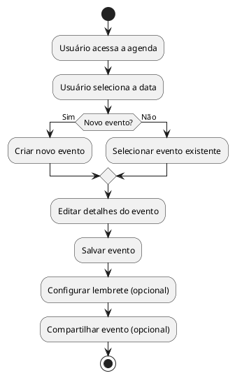

# Diagrama de Atividades

## Introdução

O Diagrama de Atividades é uma ferramenta essencial na modelagem de sistemas, permitindo representar visualmente o fluxo de trabalho de processos e cenários. Ele detalha a sequência de atividades, as decisões tomadas, os atores envolvidos e o fluxo de informações. Essa representação gráfica facilita a compreensão do comportamento do sistema, melhorando a comunicação entre a equipe de desenvolvimento e os stakeholders. Na aplicação Agenda Online, diversos Diagramas de Atividades serão utilizados para modelar os principais fluxos de interação dos usuários, como criação de eventos, configuração de lembretes, compartilhamento de agendas e gerenciamento de tarefas. Cada diagrama focará em um aspecto específico do sistema, proporcionando uma visão detalhada e completa das funcionalidades da aplicação.

## Resultados

## Explicação

O Diagrama de Atividades apresentado modela o fluxo de um usuário interagindo com a aplicação Agenda Online para criar, editar e gerenciar eventos. O diagrama inicia com o usuário acessando a agenda e selecionando uma data. Em seguida, o usuário decide se deseja criar um novo evento ou selecionar um evento existente. 

Se o usuário optar por criar um novo evento, ele insere os detalhes do evento, como nome, horário, descrição e categoria. Se optar por um evento existente, o usuário pode editar os detalhes do evento selecionado. Após inserir ou editar os detalhes, o usuário salva o evento.  

Opcionalmente, o usuário pode configurar um lembrete para o evento, definindo a antecedência e o tipo de alerta (notificação, email).  Também é possível compartilhar o evento com outros usuários, caso desejado. O diagrama finaliza com o evento salvo e as configurações de lembrete e compartilhamento definidas.

### Como Executar/Interpretar o Diagrama

O fluxo do diagrama é representado pelas setas, que indicam a sequência das atividades.  Os losangos representam pontos de decisão, onde o fluxo pode seguir diferentes caminhos dependendo da condição.  As barras paralelas (bifurcação e junção) indicam atividades que podem ser executadas simultaneamente ou que convergem para um único fluxo.

No exemplo acima, o usuário primeiro acessa a agenda e seleciona a data. Depois, ele toma a decisão: criar um novo evento ou selecionar um já existente. Após a decisão, os fluxos convergem para a atividade "Editar detalhes do evento".  As atividades opcionais, "Configurar lembrete" e "Compartilhar evento", são representadas por fluxos alternativos.

## Referências

## Histórico de Versão

| Versão | Data | Descrição | Autor(es) | Data de revisão | Revisor(es) |
| :-: | :-: | :-: | :-: | :-: | :-: |
| `1.0` | 09/11/2024  | Versão inicial do artefato. | [Vitor Feijó](https://github.com/vitorfleonardo) |  |  |
| `1.1`  | 18/11/2024 | Criação da Introdução e Explicação do Diagrama. | [Gabriel Moura](https://github.com/thegm445)     |                |             |
