# Diagramas de Comunicação/Colaboração

## Introdução

Os diagramas de comunicação, também conhecidos como diagramas de colaboração, são fundamentais para representar as interações entre os diversos elementos de um sistema em cenários específicos. Diferentemente de outros diagramas de interação, como o de sequência, o foco aqui está nas relações entre os objetos, evidenciando as mensagens trocadas entre eles. Esses diagramas ajudam a entender o comportamento do sistema e a documentar de forma clara como seus componentes colaboram para atingir objetivos.

Neste documento, apresentamos os diagramas de comunicação do sistema "Agenda de Tarefas". Foram elaborados diversos cenários distintos, organizados de forma cronológica para representar as principais ações do usuário no sistema.

## Breve explicação

Para modelar esses diagramas, foram seguidos os seguintes passos:

1. **Identificação de cenários**: Cada diagrama representa um caso de uso do sistema, focando em fluxos bem definidos.
2. **Componentes principais**: Os componentes do sistema foram identificados e conectados de acordo com suas responsabilidades e interações em cada fluxo.
3. **Mensagens**: As trocas de mensagens entre os componentes foram organizadas e numeradas, evidenciando a sequência lógica e a colaboração entre os elementos.

## Resultados

Abaixo estão os diagramas de comunicação criados, com suas respectivas legendas e explicações para auxiliar na interpretação:

---

### Login no Sistema (Email e Senha)

**Descrição:** Este diagrama aborda o fluxo básico de login. O usuário informa seu email e senha, que são validados pelo sistema. Em caso de sucesso, o usuário é autenticado e redirecionado para a página inicial.

<strong>Diagrama 1:</strong> Diagrama de Comunicação/Colaboração - Login no Sistema (Email e Senha)

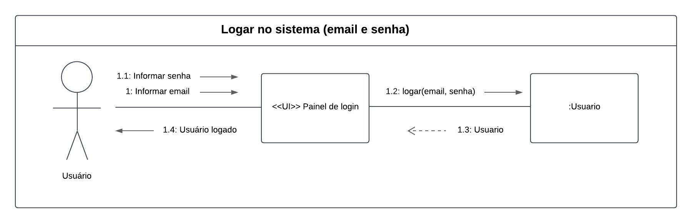

<b>Autor:</b> [João Barreto](https://github.com/JoaoBarreto03), [Gabriel Souza](https://github.com/GabrielMS00), [Ricardo Augusto](https://github.com/avmricardo), [Danilo Carvalho](https://github.com/Danilo-Carvalho-Antunes), 2024

---

### Login no Sistema (Google ID)

**Descrição:** Este diagrama ilustra o fluxo de login usando um Google ID. O usuário informa suas credenciais do Google, e o sistema as valida para permitir o acesso à plataforma.

<strong>Diagrama 2:</strong> Diagrama de Comunicação/Colaboração - Login no Sistema (Google ID)

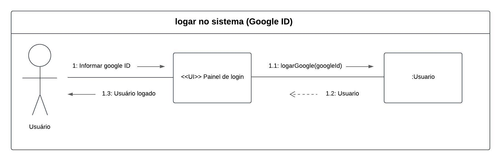

<b>Autor:</b> [João Barreto](https://github.com/JoaoBarreto03), [Gabriel Souza](https://github.com/GabrielMS00), [Ricardo Augusto](https://github.com/avmricardo), [Danilo Carvalho](https://github.com/Danilo-Carvalho-Antunes), 2024

---

### Cadastrar no Sistema

**Descrição:** Este diagrama demonstra o fluxo de cadastro. O usuário insere suas informações (nome, email e senha) para criar uma conta no sistema. Após a validação dos dados, o cadastro é concluído.

<strong>Diagrama 3:</strong> Diagrama de Comunicação/Colaboração - Cadastrar no Sistema

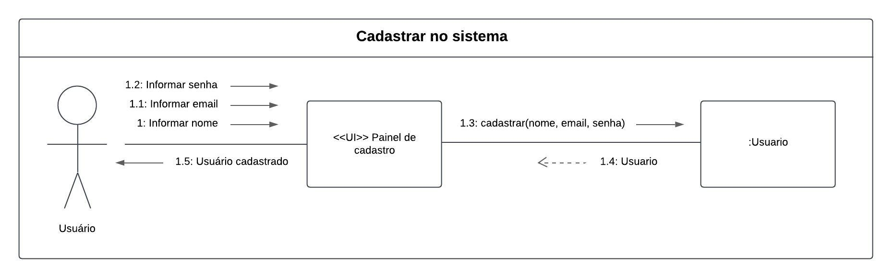

<b>Autor:</b> [João Barreto](https://github.com/JoaoBarreto03), [Gabriel Souza](https://github.com/GabrielMS00), [Ricardo Augusto](https://github.com/avmricardo), [Danilo Carvalho](https://github.com/Danilo-Carvalho-Antunes), 2024

---

### Sincronização da Agenda

**Descrição:** Neste diagrama, o usuário sincroniza sua agenda com um serviço externo, como Google Calendar. O sistema autentica o usuário e realiza a integração para sincronizar os eventos.

<strong>Diagrama 4:</strong> Diagrama de Comunicação/Colaboração - Sincronização da Agenda

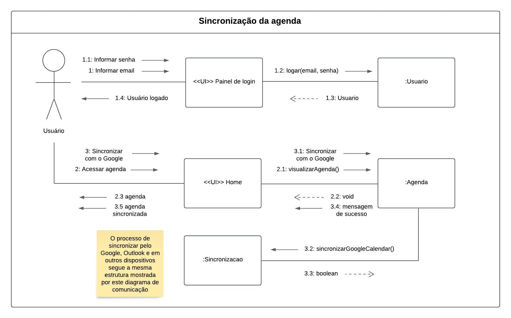

<b>Autor:</b> [João Barreto](https://github.com/JoaoBarreto03), [Gabriel Souza](https://github.com/GabrielMS00), [Ricardo Augusto](https://github.com/avmricardo), [Danilo Carvalho](https://github.com/Danilo-Carvalho-Antunes), 2024

---

### Criar Categoria

**Descrição:** Este diagrama aborda o fluxo para criar uma categoria. O usuário define um nome para a nova categoria, que é salva no sistema para organizar eventos ou tarefas.

<strong>Diagrama 5:</strong> Diagrama de Comunicação/Colaboração - Criar Categoria

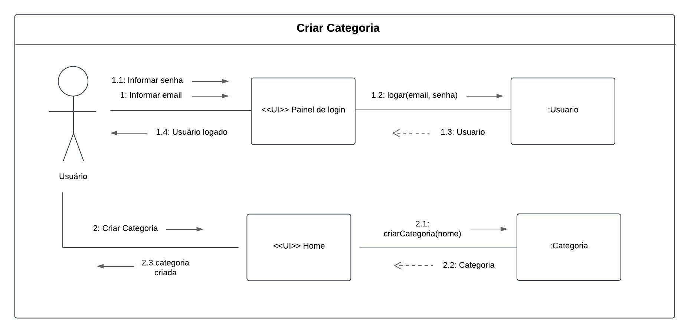

<b>Autor:</b> [João Barreto](https://github.com/JoaoBarreto03), [Gabriel Souza](https://github.com/GabrielMS00), [Ricardo Augusto](https://github.com/avmricardo), [Danilo Carvalho](https://github.com/Danilo-Carvalho-Antunes), 2024

---

### Criar Evento

**Descrição:** Neste fluxo, o usuário cria um novo evento. A partir da página inicial, o sistema solicita os dados do evento e o registra no banco de dados.

<strong>Diagrama 6:</strong> Diagrama de Comunicação/Colaboração - Criar Evento

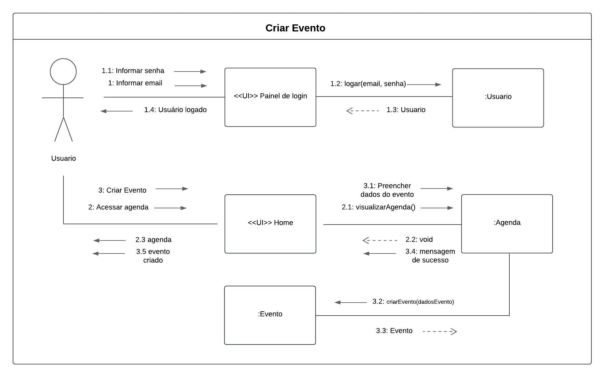

<b>Autor:</b> [João Barreto](https://github.com/JoaoBarreto03), [Gabriel Souza](https://github.com/GabrielMS00), [Ricardo Augusto](https://github.com/avmricardo), [Danilo Carvalho](https://github.com/Danilo-Carvalho-Antunes), 2024

---

### Criar Tarefa

**Descrição:** Este diagrama ilustra o fluxo de criação de uma tarefa. O usuário insere as informações da tarefa, que são validadas e salvas pelo sistema.

<strong>Diagrama 7:</strong> Diagrama de Comunicação/Colaboração - Criar Tarefa

<b>Autor:</b> [João Barreto](https://github.com/JoaoBarreto03), [Gabriel Souza](https://github.com/GabrielMS00), [Ricardo Augusto](https://github.com/avmricardo), [Danilo Carvalho](https://github.com/Danilo-Carvalho-Antunes), 2024

---

### Definir Lembrete

**Descrição:** Neste fluxo, o usuário define um lembrete para eventos ou tarefas. O sistema registra o lembrete e associa à agenda do usuário.

<strong>Diagrama 8:</strong> Diagrama de Comunicação/Colaboração - Definir Lembrete

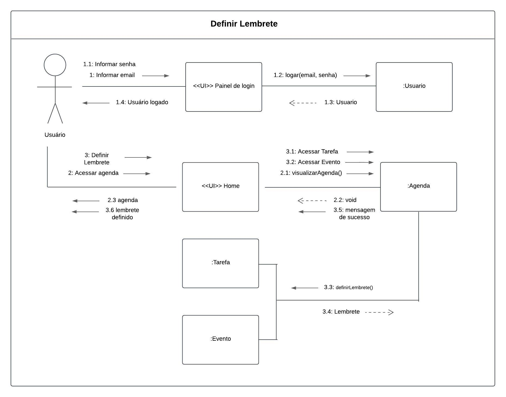

<b>Autor:</b> [João Barreto](https://github.com/JoaoBarreto03), [Gabriel Souza](https://github.com/GabrielMS00), [Ricardo Augusto](https://github.com/avmricardo), [Danilo Carvalho](https://github.com/Danilo-Carvalho-Antunes), 2024

---

### Concluir Tarefa

**Descrição:** Este diagrama descreve o fluxo de conclusão de uma tarefa. O usuário acessa a tarefa, marca-a como concluída, e o sistema atualiza o status no banco de dados.

<strong>Diagrama 9:</strong> Diagrama de Comunicação/Colaboração - Concluir Tarefa

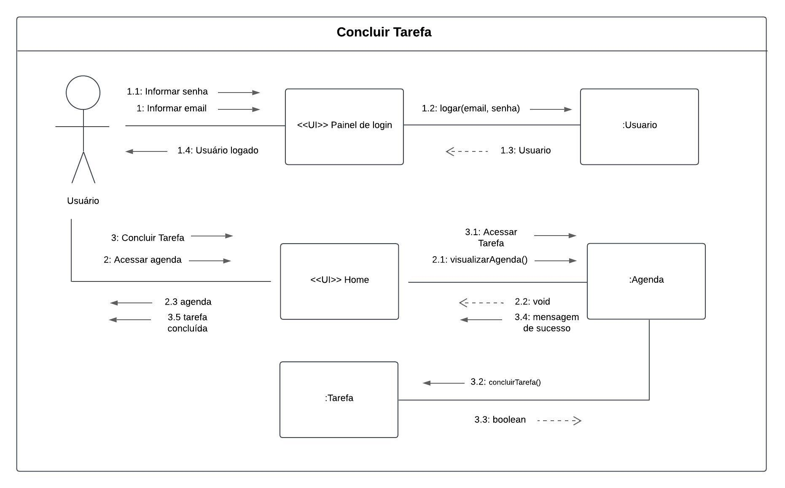

<b>Autor:</b> [João Barreto](https://github.com/JoaoBarreto03), [Gabriel Souza](https://github.com/GabrielMS00), [Ricardo Augusto](https://github.com/avmricardo), [Danilo Carvalho](https://github.com/Danilo-Carvalho-Antunes), 2024

---

### Compartilhamento de Agenda

**Descrição:** Neste fluxo, o usuário seleciona uma agenda para compartilhar. O sistema permite definir permissões e envia o convite ao destinatário.

<strong>Diagrama 10:</strong> Diagrama de Comunicação/Colaboração - Compartilhamento de Agenda

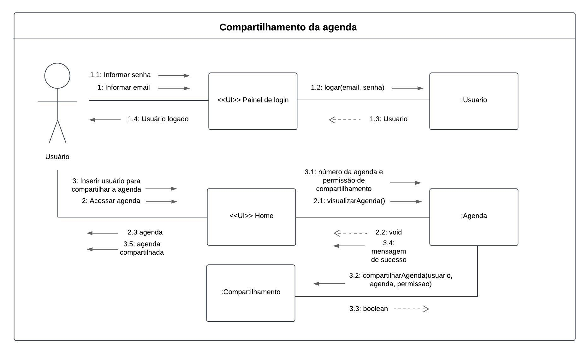

<b>Autor:</b> [João Barreto](https://github.com/JoaoBarreto03), [Gabriel Souza](https://github.com/GabrielMS00), [Ricardo Augusto](https://github.com/avmricardo), [Danilo Carvalho](https://github.com/Danilo-Carvalho-Antunes), 2024

---

### Editar Evento

**Descrição:** O usuário seleciona um evento para editar. O sistema solicita os novos dados do evento e os atualiza no banco de dados.

<strong>Diagrama 11:</strong> Diagrama de Comunicação/Colaboração - Editar Evento

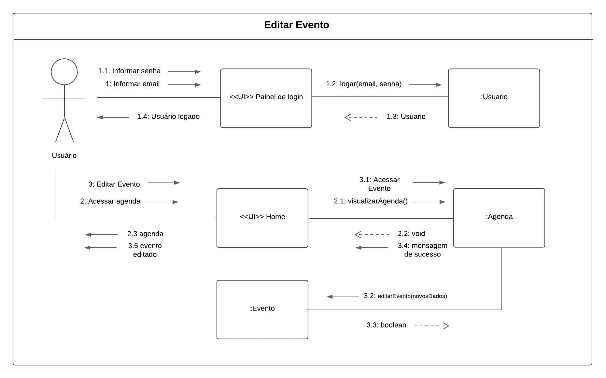

<b>Autor:</b> [João Barreto](https://github.com/JoaoBarreto03), [Gabriel Souza](https://github.com/GabrielMS00), [Ricardo Augusto](https://github.com/avmricardo), [Danilo Carvalho](https://github.com/Danilo-Carvalho-Antunes), 2024

---

### Editar Tarefa

**Descrição:** Este diagrama demonstra o fluxo de edição de uma tarefa. O usuário acessa a tarefa, insere os novos dados, e o sistema os salva.

<strong>Diagrama 12:</strong> Diagrama de Comunicação/Colaboração - Editar Tarefa

<b>Autor:</b> [João Barreto](https://github.com/JoaoBarreto03), [Gabriel Souza](https://github.com/GabrielMS00), [Ricardo Augusto](https://github.com/avmricardo), [Danilo Carvalho](https://github.com/Danilo-Carvalho-Antunes), 2024

---

### Definir Status da Tarefa

**Descrição:** Neste diagrama, o usuário altera o status de uma tarefa. O sistema atualiza o status e confirma a alteração.

<strong>Diagrama 13:</strong> Diagrama de Comunicação/Colaboração - Definir Status da Tarefa

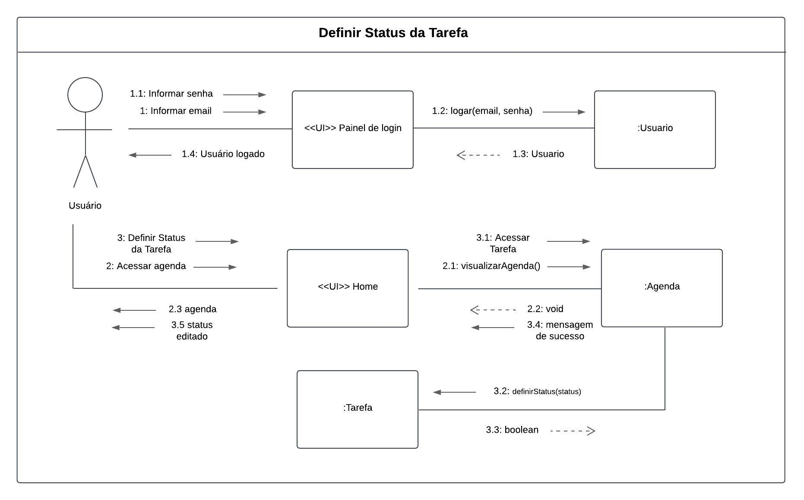

<b>Autor:</b> [João Barreto](https://github.com/JoaoBarreto03), [Gabriel Souza](https://github.com/GabrielMS00), [Ricardo Augusto](https://github.com/avmricardo), [Danilo Carvalho](https://github.com/Danilo-Carvalho-Antunes), 2024

---

### Visualização e Aplicação de Filtros na Agenda

**Descrição:** O usuário acessa a agenda e aplica filtros para visualizar eventos e tarefas de forma personalizada. O sistema retorna a agenda filtrada.

<strong>Diagrama 14:</strong> Diagrama de Comunicação/Colaboração - Visualização e Aplicação de Filtros na Agenda

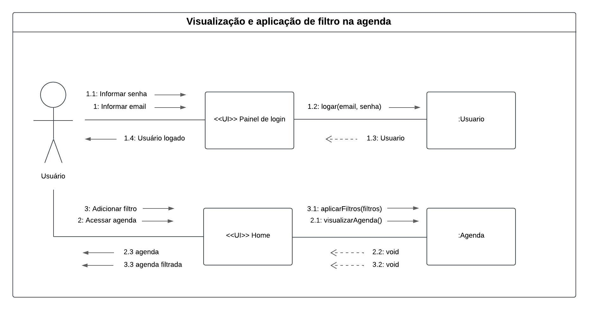

<b>Autor:</b> [João Barreto](https://github.com/JoaoBarreto03), [Gabriel Souza](https://github.com/GabrielMS00), [Ricardo Augusto](https://github.com/avmricardo), [Danilo Carvalho](https://github.com/Danilo-Carvalho-Antunes), 2024

---

### Enviar Convite para Evento

**Descrição:** Neste fluxo, o usuário envia convites para um evento. O sistema coleta os destinatários, valida os dados e dispara os convites.

<strong>Diagrama 15:</strong> Diagrama de Comunicação/Colaboração - Enviar Convite para Evento

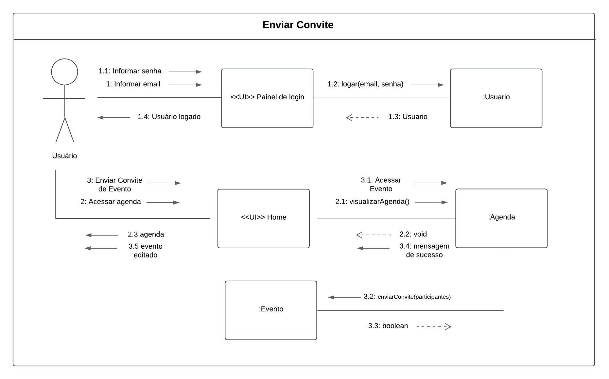

<b>Autor:</b> [João Barreto](https://github.com/JoaoBarreto03), [Gabriel Souza](https://github.com/GabrielMS00), [Ricardo Augusto](https://github.com/avmricardo), [Danilo Carvalho](https://github.com/Danilo-Carvalho-Antunes), 2024

---

### Alterar Configurações do Usuário

**Descrição:** O usuário acessa as configurações de sua conta e realiza alterações, como idioma, tema e notificações. O sistema salva essas alterações.

<strong>Diagrama 16:</strong> Diagrama de Comunicação/Colaboração - Alterar Configurações do Usuário

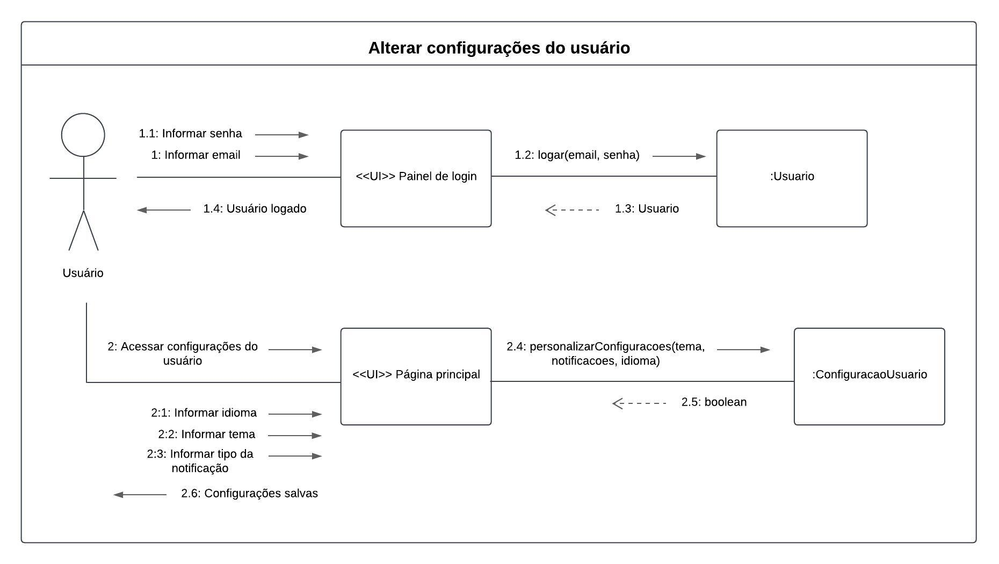

<b>Autor:</b> [João Barreto](https://github.com/JoaoBarreto03), [Gabriel Souza](https://github.com/GabrielMS00), [Ricardo Augusto](https://github.com/avmricardo), [Danilo Carvalho](https://github.com/Danilo-Carvalho-Antunes), 2024

---

## Referências

- Fowler, Martin. *UML Distilled: A Brief Guide to the Standard Object Modeling Language*. Addison-Wesley, 2003.
- Pressman, Roger S. *Engenharia de Software: Uma Abordagem Profissional*. McGraw-Hill, 2010.
- OMG. *UML Specification 2.5*. Disponível em: [https://www.omg.org/spec/UML](https://www.omg.org/spec/UML)

## Histórico de Versão

| Versão | Data | Descrição | Autor(es) | Data de revisão | Revisor(es) |
| :-: | :-: | :-: | :-: | :-: | :-: |
| `1.0` | 09/11/2024  | Versão inicial do artefato. | [Vitor Feijó](https://github.com/vitorfleonardo) | 17/11/2024 | [João Barreto](https://github.com/JoaoBarreto03) |
| `1.1` | 17/11/2024  | Explicação e construção dos Diagramas de Comunicação/Colaboração. | [João Barreto](https://github.com/JoaoBarreto03), [Gabriel Souza](https://github.com/GabrielMS00), [Ricardo Augusto](https://github.com/avmricardo), [Danilo Carvalho](https://github.com/Danilo-Carvalho-Antunes) | | |
| `1.2` | 25/11/2024  | Refatoração dos Diagramas de Comunicação/Colaboração. | [João Barreto](https://github.com/JoaoBarreto03), [Gabriel Souza](https://github.com/GabrielMS00), [Ricardo Augusto](https://github.com/avmricardo), [Danilo Carvalho](https://github.com/Danilo-Carvalho-Antunes) | | |