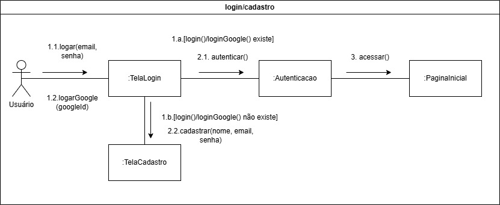
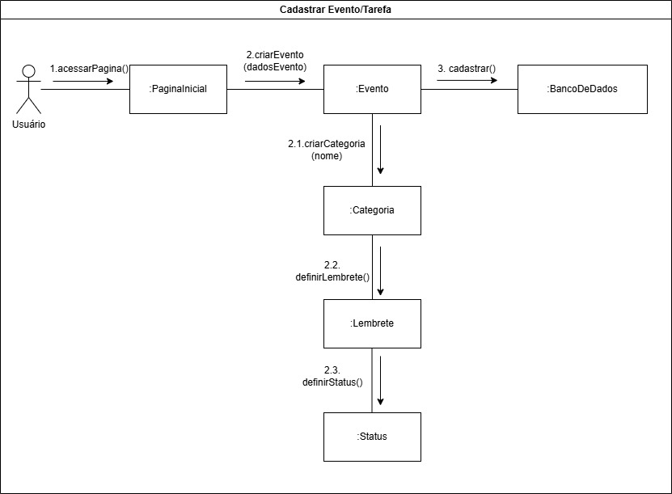
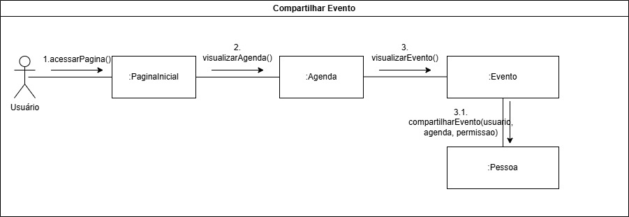

# Diagrama de Comunicação/Colaboração

## Introdução

Os diagramas de comunicação, também conhecidos como diagramas de colaboração, são fundamentais para representar as interações entre os diversos elementos de um sistema em cenários específicos. Diferentemente de outros diagramas de interação, como o de sequência, o foco aqui está nas relações entre os objetos, evidenciando as mensagens trocadas entre eles. Esses diagramas ajudam a entender o comportamento do sistema e a documentar de forma clara como seus componentes colaboram para atingir objetivos.

Neste documento, apresentamos os diagramas de comunicação do sistema "Agenda de Tarefas". Foram elaborados quatro cenários distintos: **Login/Cadastro**, **Cadastrar Evento/Tarefa**, **Compartilhar Evento** e **Visualizar Agenda**, com foco nas trocas de mensagens que ocorrem em cada fluxo.

## Breve explicação

Para modelar esses diagramas, foram seguidos os seguintes passos:

1. **Identificação de cenários**: Cada diagrama representa um caso de uso do sistema, focando em fluxos bem definidos.
2. **Componentes principais**: Os componentes do sistema foram identificados e conectados de acordo com suas responsabilidades e interações em cada fluxo.
3. **Mensagens**: As trocas de mensagens entre os componentes foram organizadas e numeradas, evidenciando a sequência lógica e a colaboração entre os elementos.

## Resultados

Abaixo estão os diagramas de comunicação criados, com suas respectivas legendas para auxiliar na interpretação:

**Login/Cadastro**: Este diagrama aborda dois fluxos principais:
    
- Quando o usuário realiza login, a tela de login verifica suas credenciais via componente de autenticação, redirecionando-o para a página inicial ao validar os dados.
- Caso os dados de login não existam, o fluxo se desvia para a tela de cadastro, onde o usuário insere as informações necessárias para criar uma conta.

 <strong> Diagrama 1:</Strong> Diagrama de Comunicação/Colaboração - Login/Cadastro <gitbr>

<b>Autor:</b> [João Barreto](https://github.com/JoaoBarreto03), [Gabriel Souza](https://github.com/GabrielMS00), [Ricardo Augusto](https://github.com/avmricardo), [Danilo Carvalho](https://github.com/Danilo-Carvalho-Antunes), 2024

**Cadastrar Evento/Tarefa**: Este diagrama demonstra o fluxo completo de criação de um evento ou tarefa. O usuário, a partir da página inicial, interage com o componente de evento para criar o item. Este fluxo se expande para definir a categoria do evento, configurar lembretes e definir o status, sendo todos os dados armazenados no banco de dados.

 <strong> Diagrama 2:</Strong> Diagrama de Comunicação/Colaboração - Cadastrar Evento <gitbr>

<b>Autor:</b> [João Barreto](https://github.com/JoaoBarreto03), [Gabriel Souza](https://github.com/GabrielMS00), [Ricardo Augusto](https://github.com/avmricardo), [Danilo Carvalho](https://github.com/Danilo-Carvalho-Antunes), 2024

**Compartilhar Evento**: Neste fluxo, o usuário navega pela página inicial e agenda até encontrar o evento que deseja compartilhar. O sistema permite especificar permissões para o destinatário antes de completar o compartilhamento.

 <strong> Diagrama 3:</Strong> Diagrama de Comunicação/Colaboração - Compartilhar Evento <gitbr>

<b>Autor:</b> [João Barreto](https://github.com/JoaoBarreto03), [Gabriel Souza](https://github.com/GabrielMS00), [Ricardo Augusto](https://github.com/avmricardo), [Danilo Carvalho](https://github.com/Danilo-Carvalho-Antunes), 2024

**Visualizar Agenda**: Este diagrama descreve como o usuário acessa sua agenda e seleciona o tipo de visualização desejada. O sistema permite visualizar os eventos de maneira categorizada e detalhada, proporcionando flexibilidade na apresentação dos dados.

 <strong> Diagrama 4:</Strong> Diagrama de Comunicação/Colaboração - Visualizar Agenda <gitbr>

<b>Autor:</b> [João Barreto](https://github.com/JoaoBarreto03), [Gabriel Souza](https://github.com/GabrielMS00), [Ricardo Augusto](https://github.com/avmricardo), [Danilo Carvalho](https://github.com/Danilo-Carvalho-Antunes), 2024

## Referências

- Fowler, Martin. *UML Distilled: A Brief Guide to the Standard Object Modeling Language*. Addison-Wesley, 2003.
- Pressman, Roger S. *Engenharia de Software: Uma Abordagem Profissional*. McGraw-Hill, 2010.
- OMG. *UML Specification 2.5*. Disponível em: [https://www.omg.org/spec/UML](https://www.omg.org/spec/UML)

## Histórico de Versão

| Versão | Data | Descrição | Autor(es) | Data de revisão | Revisor(es) |
| :-: | :-: | :-: | :-: | :-: | :-: |
| `1.0` | 09/11/2024  | Versão inicial do artefato. | [Vitor Feijó](https://github.com/vitorfleonardo) | 17/11/2024 | [João Barreto](https://github.com/JoaoBarreto03) |
| `1.1` | 17/11/2024  | Explicação e construção dos Diagramas de Comunicação/Colaboração. | [João Barreto](https://github.com/JoaoBarreto03), [Gabriel Souza](https://github.com/GabrielMS00), [Ricardo Augusto](https://github.com/avmricardo), [Danilo Carvalho](https://github.com/Danilo-Carvalho-Antunes) | | |
