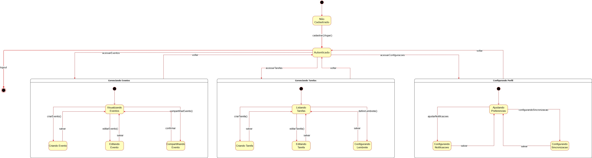
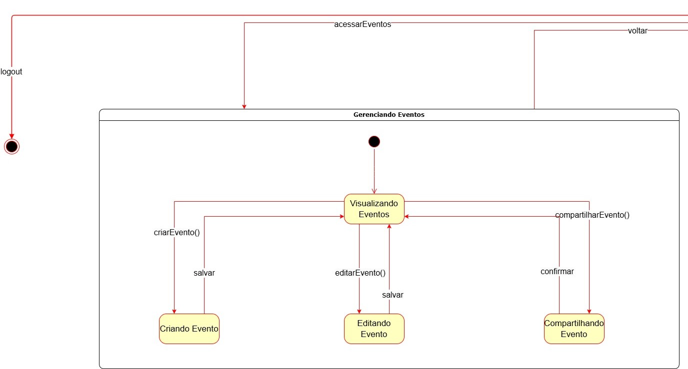
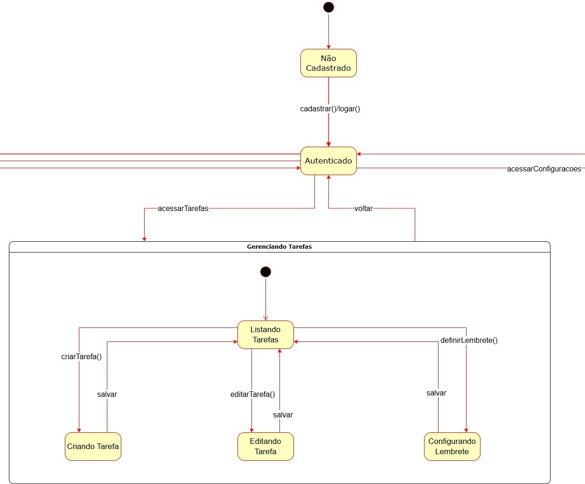
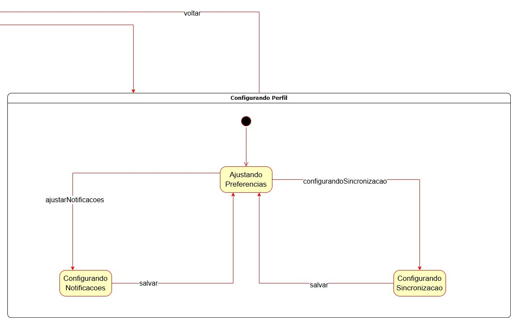

# Diagrama de Estados

## Introdução

(texto da introdução)

## Resultados

### Versão Extendida

<b>Autores:</b> [Johnny Lopes](https://github.com/JohnnyLopess), [Vitor Feijó](https://github.com/vitorfleonardo) e [Paulo Borba](https://github.com/paulohborba), 2024.

### Versão Ampliada 1 (Pate dos Eventos)

<b>Autores:</b> [Johnny Lopes](https://github.com/JohnnyLopess), [Vitor Feijó](https://github.com/vitorfleonardo) e [Paulo Borba](https://github.com/paulohborba), 2024.

### Versão Ampliada 2 (Pate das Tarefas)

<b>Autores:</b> [Johnny Lopes](https://github.com/JohnnyLopess), [Vitor Feijó](https://github.com/vitorfleonardo) e [Paulo Borba](https://github.com/paulohborba), 2024.

### Versão Ampliada 3 (Pate do Perfil)

<b>Autores:</b> [Johnny Lopes](https://github.com/JohnnyLopess), [Vitor Feijó](https://github.com/vitorfleonardo) e [Paulo Borba](https://github.com/paulohborba), 2024.

### Legenda do Diagrama de Estados

#### Estados

    Representados por caixas amarelas com os nomes das ações ou etapas específicas do sistema.

#### Transições

    As setas conectam os estados, indicando os possíveis fluxos de navegação ou ações executadas pelo usuário.

#### Estado Inicial

    Um círculo sólido indica o ponto de início do fluxo.

#### Estado Final

    Um círculo com borda grossa ao redor de outro círculo sólido representa o término do fluxo.

#### Eventos ou Ações

    Etiquetas nas setas descrevem os eventos que causam a transição de um estado para outro, como "cadastrar()", "salvar", ou "voltar".

## Breve explicação

(Explicação da metodologia e descrição do resultado obtido na medelagem)

## Referências

> <a>1.</a> UML Diagrams. **State Machine Diagrams**. Disponível em: [UML diagrams State Machine Diagrams](https://www.uml-diagrams.org/state-machine-diagrams.html)  Acesso em: 19/11/2024.  
> <a>2.</a> Lucid Software Inc. (s.d.). Lucidchart. Disponível em: [LucidChart](https://www.lucidchart.com/pages/pt/o-que-e-diagrama-de-maquina-de-estados-uml). Acesso em: 19/11/2024.  

## Histórico de Versão

| Versão | Data | Descrição | Autor(es) | Data de revisão | Revisor(es) |
| :-: | :-: | :-: | :-: | :-: | :-: |
| `1.0` | 09/11/2024  | Versão inicial do artefato. | [Vitor Feijó](https://github.com/vitorfleonardo) | [Paulo Borba](https://github.com/paulohborba) |  |
| `1.1` | 20/11/2024  | Adicionando as Referências e a parte dos Resultados do artefato. | [Paulo Borba](https://github.com/paulohborba) |  |  |
