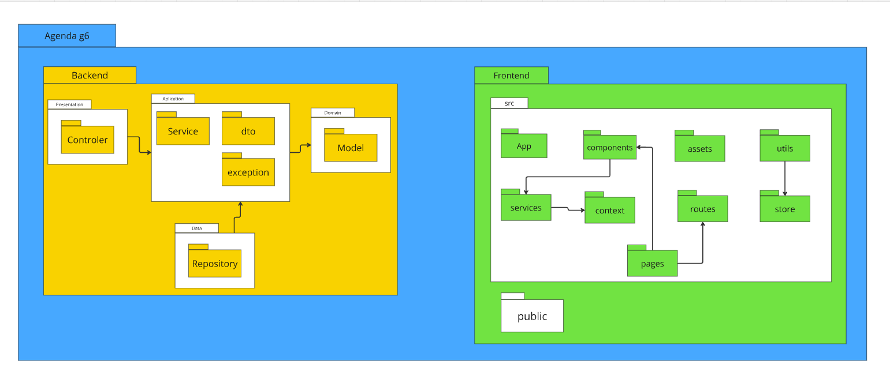
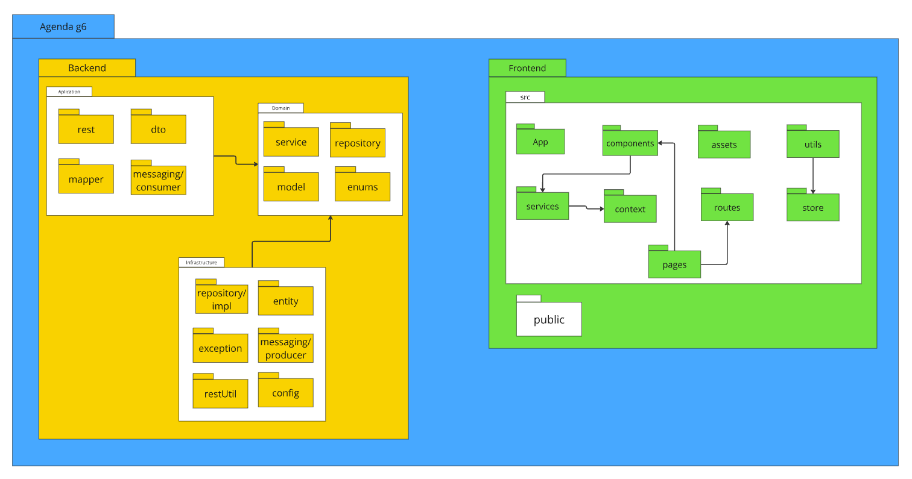

# Diagrama de Pacotes

## Introdução

Os diagramas de pacotes são uma forma de diagrama estrutural da UML usados para representar a estrutura de sistemas em termos de pacotes. Eles ajudam a organizar e visualizar a arquitetura de um sistema, agrupando elementos relacionados dentro de pacotes e representando as interações entre eles. Cada pacote pode conter diagramas, documentos, classes ou outros pacotes, sendo representado visualmente como uma pasta de arquivo em um diagrama hierárquico.

Eles desempenham um papel essencial em projetos de software, especialmente na modelagem de sistemas complexos, onde fornecem uma visão clara e organizada da estrutura hierárquica e das dependências entre os componentes.

### Elementos 

- **Pacote** 
  - Descrição: Agrupa elementos logicamente relacionados com base em dados, comportamento ou interação do usuário.
  - Representação: Uma pasta de arquivo no diagrama.

- **Elemento Empacotável**
  - Descrição: Um elemento nomeado que pertence diretamente a um pacote.
  - Exemplos: Eventos, componentes, casos de uso e pacotes.

- **Dependência**
  - Descrição: Representa como um elemento depende ou influencia outro.
  - Tipos:
    - Acesso: Um pacote requer assistência das funções de outro.
    - Importação: A funcionalidade de um pacote é importada para outro.

- **Importação de Elemento**
  - Descrição: Relacionamento direcionado entre um espaço de nomes de importação e um elemento empacotável.
  - Objetivo: Importar elementos individuais sem torná-los públicos no espaço de nomes.

- **Importação de Pacote**
  - Descrição: Relacionamento direcionado entre um espaço de nomes de importação e um pacote importado.
  - Objetivo: Adicionar os nomes dos membros do pacote importado ao espaço de nomes do importador.

- **Mesclagem de Pacotes**
  - Descrição: Relacionamento direcionado onde o conteúdo de um pacote é estendido pelo conteúdo de outro.
  - Objetivo: Combinar dois pacotes em um novo.

- **Notações de Dependência**
  - Uso: Elemento requer outro para definição e implementação.
  - Abstração: Relaciona elementos que representam o mesmo conceito em níveis de abstração diferentes.
  - Disponibilização: Mostra a implementação de um artefato em um alvo de implementação.

## Resultados

 <strong> Versão 1:</Strong> Diagrama de Pacotes - Agenda <gitbr>

<b>Autor:</b> [Hugo](https://github.com/melohugo), [Ricardo](https://github.com/avmricardo), [Bianca](https://github.com/BiancaPatrocinio7), [Vitor Feijó](https://github.com/vitorfleonardo), [Julia](https://github.com/juhvitoria4), [Yago](https://github.com/yagompassos)   , 2024

 <strong> Versão 2:</Strong> Diagrama de Pacotes - Agenda <gitbr>

<b>Autor:</b> [Ricardo Augusto](https://github.com/avmricardo), 2024

[Link para o miro.](https://miro.com/app/board/uXjVLAbgimw=/)

## Breve explicação

### Backend

#### Camada de Aplicação

Receber requisições, seja de
endpoints (pacote rest com controllers) seja via fila (messaging/consumer) caso seja necessário implementar um serviço de filas de mensages.

- rest: Pacote com controllers para receber chamadas via endpoints;
- dto: Classes com informações de request ou response vindas de controller ou consumer;
- mapper: Mapeamento entre DTOs e classes que serão utilziadas em services;
- messaging/consumer: Receber requisições vindas de filas de mensagens.

#### Camada de domínio

Processamento de dados e implementação de regras de negócio.

- repository: Apenas as interfaces, com o cabeçalho dos métodos mas sem fazer suas implementações, com o intuito de ilustrar quais requisições ao banco de dados poderão ser feitas. Interface a ser chamada por determinados métodos da service;
- service: Interfaces para serem acessadas pela camada de aplicação, outro pacote service/impl com as implementações das interfaces;
- enums: Pacote com classes com atributos fixos, utilizados para representar atributos domínio;
- model: Classes utilizadas para fazer processamento de requisições.

#### Camada de infraestrutura

Comunicação e solicitações de informações externas, seja via persistência ou acesso ao banco de dados (repository/impl e entity) ou seja por envio de mensagens em filas (messaging/producer).

- repository/impl: Implementação das interfaces do repository da camada de aplicação, utilizando as anotações de persistência de dados.;
- entity: Classes das tabelas na base de dados utilizando anotações de persistência no BD;
- config: Classe para configuração de beans (caso seja utilizado Java), ou outras estruturas do framework utilizado.
- restUtil: Classe/pacote para implementar métodos para poder realizar chamadas de endpoints, caso seja necessário acessar microserviços diferentes ou fazer chamadas assíncronas. Apenas implementação dos métdos, suas chamadas devem ficam em implementações das interfaces de services.

## Referências

<a>1. </a> Fakhroutdinov, Kirill. **UML Package Diagrams Overview**. Disponível em: [uml-diagrams.org](https://www.uml-diagrams.org/package-diagrams-overview.html) 
<a>2. </a> LucidChart. **Tudo sobre diagramas de pacotes UML**. Disponível em: [LucidChart](https://www.lucidchart.com/pages/pt/diagrama-de-pacotes-uml) 
<a>3. </a> ŁUKASZ RYŚ. **Organizing Layers Using Hexagonal Architecture, DDD, and Spring**. Disponível em: <https://www.baeldung.com/hexagonal-architecture-ddd-spring>.

## Histórico de Versão

| Versão | Data | Descrição | Autor(es) | Data de revisão | Revisor(es) |
| :-: | :-: | :-: | :-: | :-: | :-: |
| `1.0` | 09/11/2024  | Versão inicial do artefato. | [Vitor Feijó](https://github.com/vitorfleonardo) | 26/11/2024  | [Yago Passos](https://github.com/yagompassos)  |
| `1.1` | 26/11/2024  | Seção de introdução | [Yago Passos](https://github.com/yagompassos) | 28/11/2024 | [Ricardo Augusto](https://github.com/avmricardo) |
| `1.2` | 28/11/2024 | Adicionando resultados | [Ricardo Augusto](https://github.com/avmricardo) | | |
